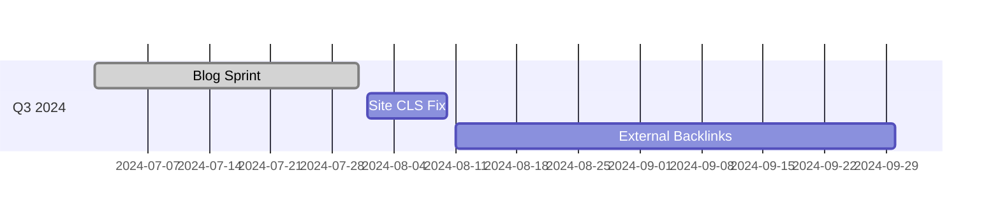

# Compound SEO Playbook

> Last updated: 2024-06-28

This guide explains how to leverage **GitHub README + Next.js main site (aferdzhou.com) + Webflow microsite** to build unified search authority.

---

## 1. Keyword & Content Matrix

| Tier | Example Keywords | Where to use |
|------|------------------|--------------|
| Core | Afred Zhou, Creative Designer, Web Design, XR/AR | README H1, Site title, hero section |
| Support | responsive website, UI/UX, interactive prototype | Blog headings, project blurbs |
| Long-tail | "convert 3D model to WebAR", "AI SaaS dashboard design" | Case studies, how-to articles |

---

## 2. Cross-Platform Linking

1. **README → Live Site**
   "View live site" badge or text link.
2. **Blog → GitHub**
   Source code reference, PR links.
3. **GitHub Releases → Portfolio**
   In release notes point back to new case study page.

---

## 3. Technical SEO Setup

### Next.js (aferdzhou.com)

- `next-seo` for global meta-tags.
- `next-sitemap` to auto-generate sitemap & robots.txt.
- Dynamic OG images via `@vercel/og`.
- `schema.org` JSON-LD injected with `next/script`.

### Webflow

- Ensure unique `<title>` / `<meta description>` per page.
- Minify & lazy-load images, enable WebP.
- Inject JSON-LD in Page → Custom Code → Head.

---

## 4. Schema Markup Snippets

```json-ld
{
  "@context": "https://schema.org",
  "@type": ["Person", "Organization"],
  "name": "Afred Zhou",
  "url": "https://aferdzhou.com",
  "sameAs": [
    "https://github.com/afredzhou",
    "https://www.linkedin.com/in/afredzhou"
  ]
}
```

More examples: Project (`CreativeWork`), Blog (`BlogPosting`).

---

## 5. Performance & Web Vitals

| Metric | Target | Tip |
|--------|--------|-----|
| LCP | ≤ 2.5 s | `next/image` with `priority` on hero |
| CLS | ≤ 0.1 | Reserve space for images/fonts |
| INP | ≤ 200 ms | Limit 3rd-party scripts |

Automate in CI using `calibreapp/web-vitals-action`.

---

## 6. Content Cadence

| Cycle | Task | Deliverable |
|-------|------|------------|
| Weekly | Write 600-800-word long-tail post | Blog / Case Study |
| Monthly | Update README + earn 1 backlink | Git commit / Guest post |
| Quarterly | Publish 2k-word flagship study | Landing page + video |

---

## 7. Roadmap (Mermaid)



---

## 8. Tracking Dashboard

- Google Search Console → clicks, queries.
- GitHub API → README views.
- Looker Studio → Combine GSC + GA4 + Sheets for backlinks.

---

**Keep publishing, keep linking, keep measuring – that's compound SEO.**
